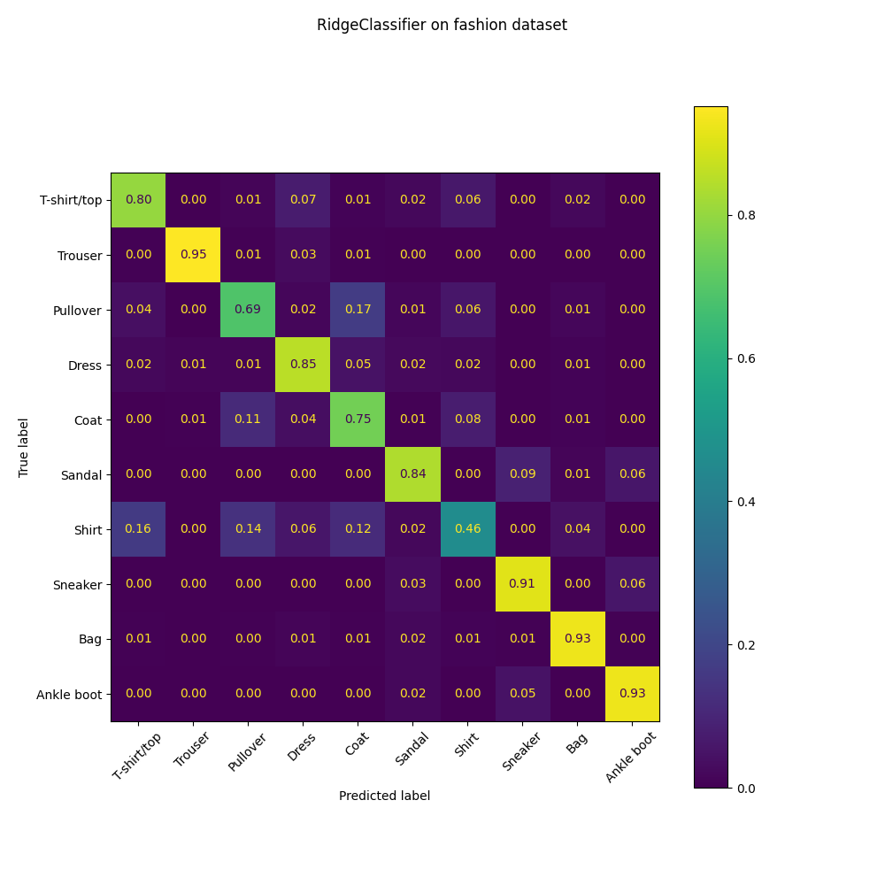
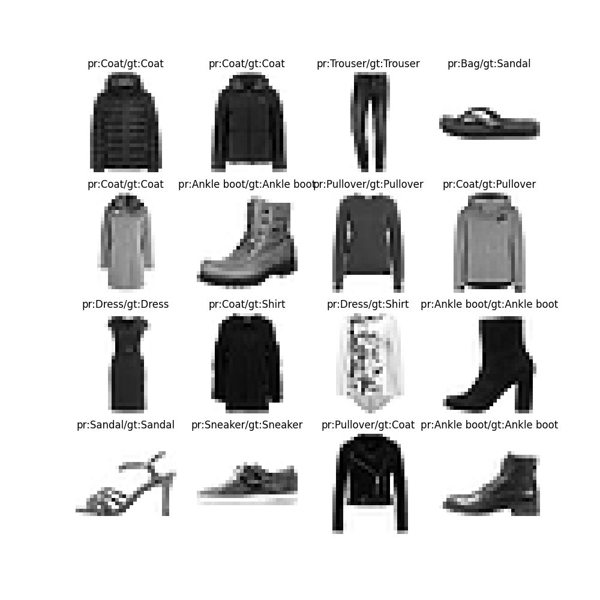
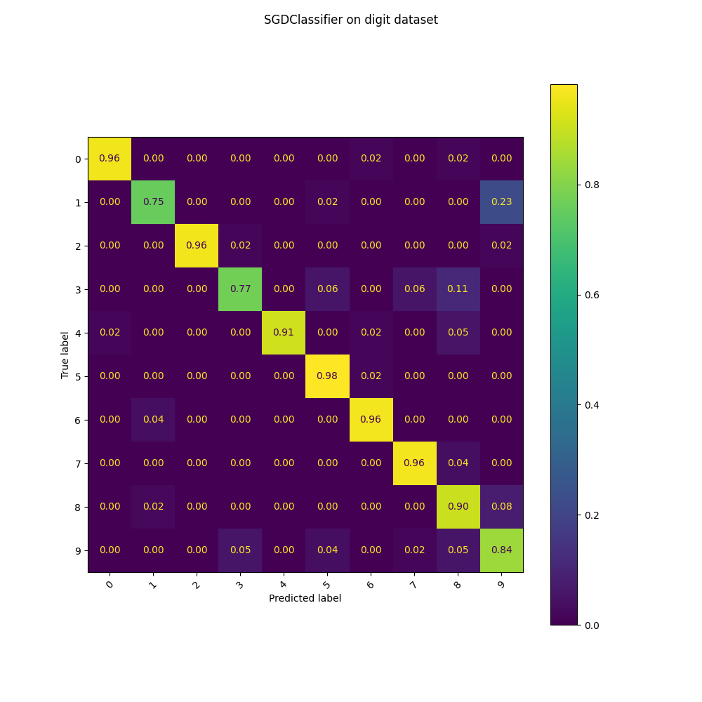
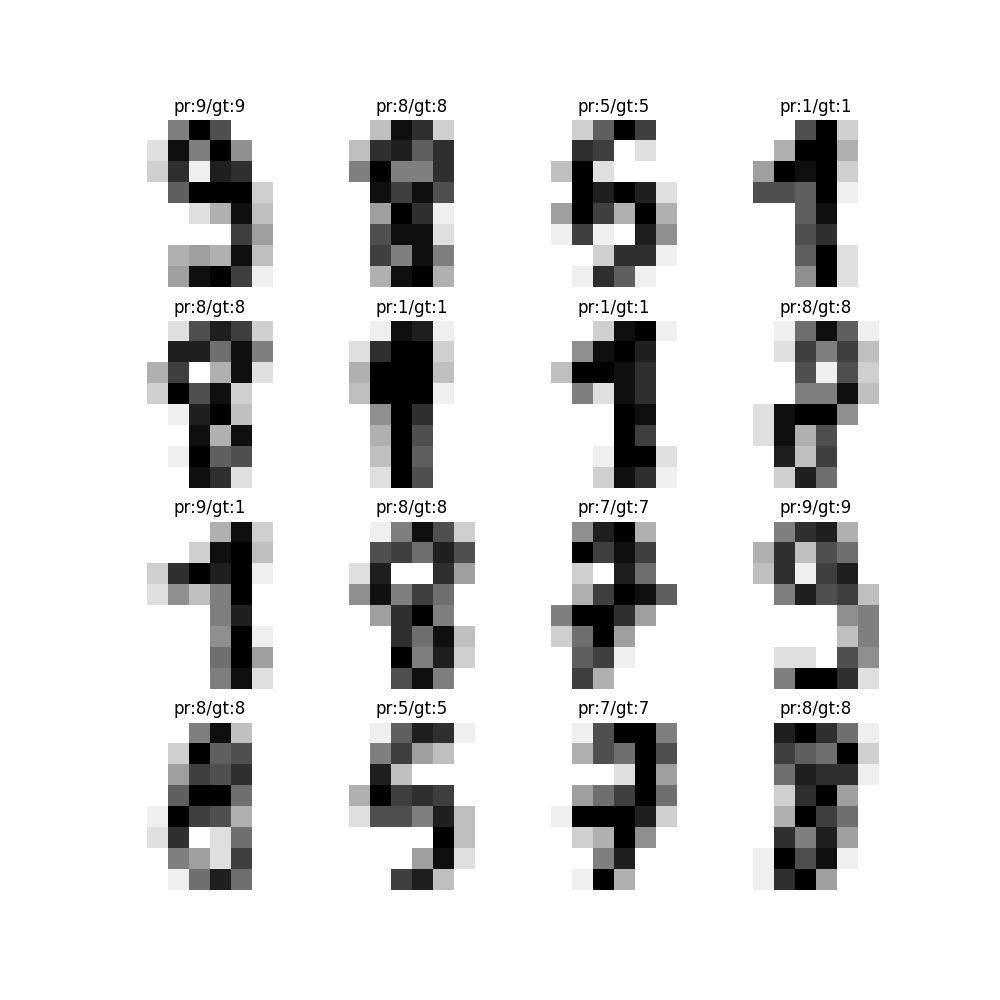
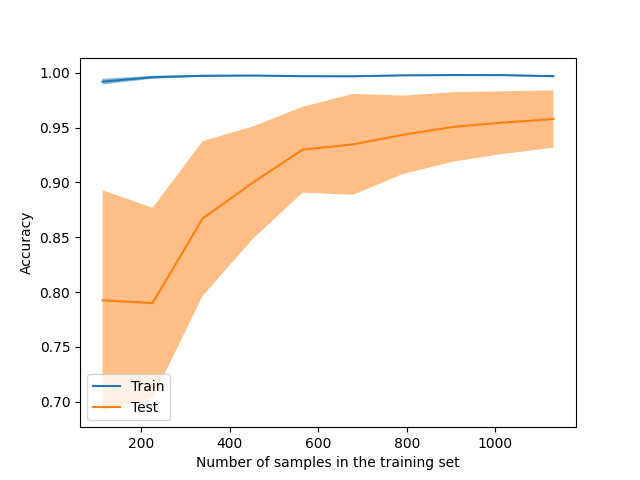
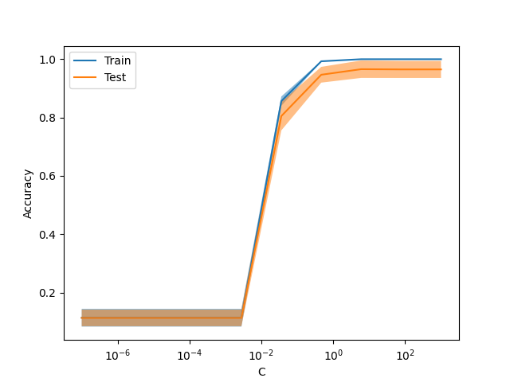

# Image classification using the scikit-learn library
This project provides an easy way to use many classification models in the scikit-learn library.
# About this project:
1. This is a personal project, for educational purposes only!
2. You can train, tune the hyper-parameters, and validate any model with only one command line.
3. Supports two datasets (handwritten, fashion mnist) and almost classification models.
# How to use:
1. Clone project, cd into sklearn_classification.
2. Install the requirements: pip install -q -r requirements.txt.
3. To train the model, modify the config file in the "./configs/train" directory (for example, './configs/train/RidgeClassifier.yaml'), then run the below command:
```
python train.py --config_file './configs/train/RidgeClassifier.yaml'
```
 \

```
              precision    recall  f1-score   support

 T-shirt/top       0.78      0.80      0.79      1000
     Trouser       0.97      0.95      0.96      1000
    Pullover       0.71      0.69      0.70      1000
       Dress       0.79      0.85      0.82      1000
        Coat       0.68      0.75      0.71      1000
      Sandal       0.84      0.84      0.84      1000
       Shirt       0.67      0.46      0.55      1000
     Sneaker       0.86      0.91      0.89      1000
         Bag       0.89      0.93      0.91      1000
  Ankle boot       0.89      0.93      0.91      1000

    accuracy                           0.81     10000
   macro avg       0.81      0.81      0.81     10000
weighted avg       0.81      0.81      0.81     10000
```
4. To tune the hyper-parameters, modify the config file in the "./configs/search" directory (for example, './configs/search/GridSearchCV.yaml'), then run the below command. The best configuration will be searched in the parameter space; after that, the model will use this one to refit.
```
python train.py --config_file './configs/search/GridSearchCV_SGDClassifier.yaml'
```
   \
  
```
best_config.yaml
model_config:
  alpha: 0.01
  loss: log_loss
```
```
              precision    recall  f1-score   support

           0       0.98      0.96      0.97        53
           1       0.93      0.75      0.83        53
           2       1.00      0.96      0.98        53
           3       0.91      0.77      0.84        53
           4       1.00      0.91      0.95        57
           5       0.90      0.98      0.94        56
           6       0.95      0.96      0.95        54
           7       0.93      0.96      0.95        54
           8       0.76      0.90      0.82        52
           9       0.73      0.84      0.78        55

    accuracy                           0.90       540
   macro avg       0.91      0.90      0.90       540
weighted avg       0.91      0.90      0.90       540
```
5. To know how the hyper-parameters or the dataset size impact on the model's performance, modify the config file in the './configs/validation' directory (for example, './configs/validation/SVC.yaml'), then run the below command:
```
python validate.py --config_file './configs/validation/SVC.yaml'
```
 \
 \
6. For simplicity, this project doesn't provide a professional dataset object (like PyTorch). If you use other datasets, modify the python file './datasets.py'.
> define a new method
```
def _get_yourdataset(self):
  # do something
  ds = {
        'train_data': X_train,
        'train_label': y_train,
        'test_data': X_test,
        'test_label': y_test,
        'class_name': class_name,
        'name': 'your_dataset_name'
  }
  return ds
```
> modify the '\__init__' method:
```
def __init__(self):
  assert dataset in ['digit', 'fashion', 'yourdataset'], \
  f'{dataset} is not supported'
  if dataset == 'digit':
    self.dataset = self._get_digit()
  if dataset == 'fashion':
    self.dataset = self._get_fashion()
  if dataset == 'yourdataset':
    self.dataset = self._get_yourdataset()
```
> Note: The dataset should be gray images. It is an array of shape (n_samples, height, width).


